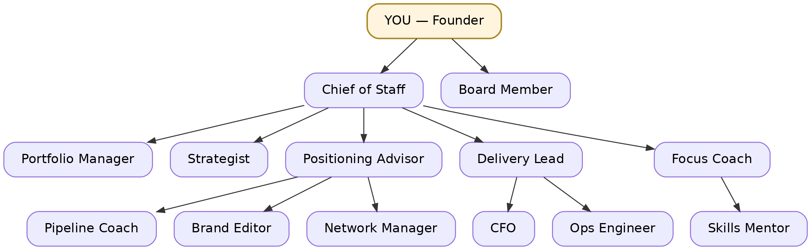

# Founder OS

> The executive team you can't afford yet — strategy, offer, pipeline, delivery, money and focus for a company of one.



Most AI setups hire you staff. This one is the org that holds you accountable.

You are the Founder. These thirteen agents are your exec team, and each one owns
exactly one decision you keep postponing. Run one business or several — each
business is its own workspace, and the thirteenth agent exists to rank between
them.

**Founder OS is free and MIT-licensed.** It runs inside your existing Claude
Code environment and adds no account or subscription of its own.

[Getting started](../docs/getting-started.md) ·
[Example workspace](../examples/studio-north/README.md) ·
[All 49 workflows](COMMANDS.md) ·
[Report an issue](https://github.com/msolecki/founder-os/issues)

## Before you install

| Requirement | Purpose |
|---|---|
| Recent [Claude Code](https://code.claude.com/docs) | Founder OS is a plugin, not a standalone app. |
| Python 3 | Runs the write-time ownership hook. |
| PyYAML | Enables the full ownership-map check; the hook degrades gracefully without it. |
| `cron` *(optional)* | Runs scheduled cadences. Every workflow also works manually. |

The agents are specialized roles invoked when needed, not thirteen autonomous
processes running all day. Ten cadences can optionally run on a local
schedule; the rest run when you call them or when the Chief of Staff routes a
question.

Founder OS knows only what is recorded in its Markdown workspace or supplied
in the current Claude Code session. It does **not** automatically sync your
calendar, CRM, inbox, bank account, or accounting system. Workspace files stay
on your machine; Claude Code's own data-handling terms still apply to prompts
and context sent through it.

## Install

```
/plugin marketplace add msolecki/founder-os
/plugin install founder-os@founder-os
```

Then, once:

```
/founder-os-init
```

An org of agents and an empty directory is not a product yet. Onboarding takes
about twenty minutes and ends by handing you your first brief — not a filing
cabinet.

Then, if you want the company to come to you rather than wait to be opened:

```
/setup-cadences
```

This writes local cron entries with your consent. They run only while your
machine and cron service are running. There is no Founder OS cloud scheduler;
every cadence also works by hand.

Want to see the result before installing? Start with the fictional but
contract-shaped
[`examples/studio-north/reviews/daily/2026-07-20.md`](../examples/studio-north/reviews/daily/2026-07-20.md),
then follow `q-0720a` and `B1` across its queue, goals, week, pipeline, and
reviews.

## What's inside

| Content | Count |
|---------|-------|
| Agents  | 13    |
| Skills  | 49    |
| Cadences | 10   |

The full catalogue — every skill, its agent, and its schedule — is
[`COMMANDS.md`](COMMANDS.md), generated from the package so it cannot drift.

## The org

| Agent | Only this agent decides… |
|---|---|
| Chief of Staff | What deserves your attention now, and who handles it |
| Board Member | Whether a plan survives contact with reality |
| Strategist | What bet we make this quarter — and what we kill |
| Positioning Advisor | Exactly who we serve and what we sell them |
| Pipeline Coach | What happens next with each prospect |
| Delivery Lead | Whether we can take this on, and if it's good enough to ship |
| CFO | Whether we can afford it and if it actually makes money |
| Focus Coach | What goes in the calendar — and what comes out |
| Skills Mentor | Which capability to build next, and how |
| Brand Editor | What to publish, and where |
| Network Manager | Who to talk to, and when to follow up |
| Ops Engineer | What to automate vs. tolerate |
| Portfolio Manager | How your hours and cash split across businesses (multi-business installs) |

Thirteen agents only works if each owns a decision no other agent can make. That
was the test every agent had to pass to ship — and the reason there are thirteen
of them rather than a hundred and sixty-seven.

They are role definitions, not always-on workers. A command invokes the role
that owns its decision; a scheduled cadence invokes one at its configured time.

Ask the **chief-of-staff** when you don't know who to ask. Routing is its one
decision, and it can summon the rest of the org; they cannot summon each other
sideways. The org chart is the agent graph, not a diagram in a README.

## A day with Founder OS

Morning: if you enabled local cadences and the machine was running, the brief is
already there — `/daily-brief` ran at 08:00 and named the one thing that matters
today. Otherwise, you type it yourself. A thought at 15:00 with
no session open: append one line to `inbox.md`, no fields, no ceremony — the
next brief or `/triage` drains it. A prospect to move: `/pipeline-review`. A
draft to send: `/outreach-draft` writes it to `drafts/`, you press send.
Friday: `/weekly-review` compares committed to done and sweeps the queue.
Month-end: `/revenue-review` closes the books. Don't know who to ask? Ask the
chief-of-staff — routing is its decision, not yours. The full catalogue with
schedules is [`COMMANDS.md`](COMMANDS.md).

## More than one business

One workspace per business — each a complete, ordinary Founder OS — and a
registry (`~/.founder-os/businesses.yaml`) that names them. Every cadence takes
the business slug as an argument; cron lines carry it per fence, so two
businesses hold two schedules in one crontab without touching each other. What
multi-business adds is exactly one decision: **how your hours and cash split
across businesses** — the Portfolio Manager owns it, `/portfolio-review` makes
it weekly, and `portfolio.md` records it. Everything else deliberately stays
per-business: no agent reads across books except the portfolio-manager, and it
reads two sections per business, not the books. Full procedure:
`references/multi-business.md`.

## It comes to you

Most tools wait to be opened. Founder OS runs on a schedule: a brief every
weekday morning, and a cadence for every file that rots — the week, the
pipeline, the content plan, the follow-ups, the review, the close, the quarter.

**Being honest about how:** Claude Code cannot ship a schedule inside a plugin.
Session loops expire after seven days; cloud routines can't see your local
files, and your workspace is local markdown by design. So `/setup-cadences`
writes cron entries on **your** machine that call the skills headless. One
setup, then it runs while that machine and cron service are on. Missed cron
times do not become cloud catch-up runs. Every cadence also works invoked by
hand — the rhythm is the point, not the mechanism.

A personal-development tool that only runs when you remember to run it is the
failure mode of every productivity system ever shipped. That's the part this
package refuses to repeat, and it won't pretend the plumbing is magic.

## Memory

State lives in a markdown workspace (`FOUNDER_OS_HOME`, default
`./founder-os/`): inbox, charter, goals, metrics, offer, pipeline, week, queue,
clients, drafts, network, skills, content, voice, systems — and a decision log
that records *why*, not just what. Six months from now you will want to know
why you raised rates or dropped a client. That's the file that answers.

**That workspace is the whole data boundary.** Founder OS does not silently
read a calendar, CRM, inbox, bank, or accounting tool. If a fact is not in the
workspace or the current session, the agents do not know it. This is why the
example workspace shows the source file behind every daily-brief claim instead
of implying a live integration.

**Every file has exactly one owner.** Agents read anything and write only what
they own. A `PreToolUse` hook checks every write against
`references/ownership.yaml` and refuses the ones that cross a line — so it is a
rule the runtime applies, not a promise the prose makes. (It is operational
policy, not a security boundary: hooks act at the tool call, and anything with
a shell can route around them. Our agents have no shell.)

**Work doesn't evaporate.** A brief that says "follow up with Anna" leaves an
item in `queue.md`, not a feeling. It has an id, a bet it serves, and a date —
and if it sits for 21 days it is dropped automatically, with a reason. An item
nobody started in 15 working days was passed over by 15 daily briefs; the queue
just writes down a decision you already made fifteen times. A queue that only
grows is a to-do list, and you already have one of those.

**There is a door.** `inbox.md` takes a line from you at 15:00 with no session,
no agent, no fields and no ceremony. The next brief or triage empties it to
zero — every line becomes a queue item, or gets named and refused with the
owner whose file already holds it. It has no clock because it has a drain.
Nothing lives in a door.

**Nothing is written just because someone said it.** Every skill that
records what someone outside told you tiers the claim before it reaches a file:
fact, validate, or disregard. What a counterparty says about their own
situation is a fact; what you say to win the room is positioning. Provenance
lands in the line itself (`per Anna, buyer at Acme, call, 12 May`) — a file's
timestamp tells you when someone touched it, not when the claim was last true.

**It speaks your language.** The section headings are pinned English — they are
the machine contract — but everything under them is yours: a Polish founder gets
a Polish workspace under English headings, and no skill will translate your
pipeline at you. If you already keep a style guide or a banned-phrases list,
init will offer to import it into `voice.md` instead of making you teach it
twice.

**It writes like you, or it says it can't.** `voice.md` holds real samples of
your writing — not adjectives about it. "Friendly but professional" describes
90% of business writing and constrains nothing; three real emails beat any
adjective. Your edits before sending get harvested back, because that's you
correcting the machine.

## What it won't do

**It never sends. It never pays.** No email, no post, no invoice, no
signature, no subscription cancelled — whatever the agent, however obvious the
send, however explicitly you asked mid-flow. It drafts; you press the button.

And the draft is still there when you get back to it. Bodies live in `drafts/`,
not in the terminal scrollback — with the version you actually sent underneath,
which is the only place your edits to our prose survive the session. A drafting
tool whose drafts die when you close the tab is one that quietly asks you to do
the work twice.

This one isn't a promise either: **no agent in this package has a shell, a
browser, or an MCP tool.** Their tool allowlists hold file tools (`Read, Write,
Edit, Glob, Grep`) plus, for managers only, the `Agent(...)` edges of the org
chart — and nothing that can reach the outside world. The board-member cannot
even write. If your setup connects a mailbox, the agents still cannot reach it. A wrong opinion costs an argument; a sent email costs a
client.

**The CFO gives no tax or legal advice. The Focus Coach gives no medical
advice.** Both will tell you which professional to see and what number or
observation to bring them, so the meeting takes fifteen minutes instead of an
hour.

## It has opinions

Every role skill states at least three principles a competent generic advisor
would not say. The section is required and machine-checked; the bar itself was
held by review — no regex reaches "would a generic advisor say this?". Without
them you get Wikipedia advice the moment you step off the script, which is
precisely when you needed an opinion.

> *"Continuing has no invoice. Killing feels like the loss because it comes
> with a date and a number attached, while a bet running at 20% for another
> quarter costs more and never sends a bill."*

> *"Your price is not low because you undervalue your work. It is low because a
> low price is an effective way of not being rejected, and it is working."*

> *"Over 40% of revenue is not a client, it is an employer."*

You are meant to disagree with some of them. That is the point — an argued
position can be improved, a platitude can only be nodded at.

## Extending it

`references/skill-template.md` is the template every skill follows.
`references/ownership.yaml` is the map: who owns each file, and which sections
live inside it. Add a skill, declare what it writes, and make sure its agent
owns that path — the validator (`scripts/validate_package.py`, in the source
repo alongside the tests) fails the build if it doesn't.

Requires a recent Claude Code — the agent tooling this relies on has moved
fast.

## License

Free and MIT-licensed. See [`LICENSE`](LICENSE).

## Help

Read the repository's [`docs/getting-started.md`](../docs/getting-started.md),
browse the generated [`COMMANDS.md`](COMMANDS.md), or
[open an issue](https://github.com/msolecki/founder-os/issues).
